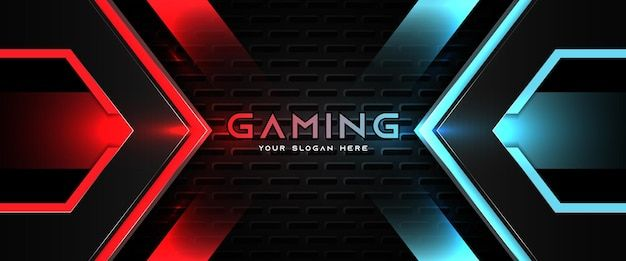

# 👋 Bonjour, moi c'est Theo FERRETE  

-----

Bienvenue sur mon GitHub ! Je suis en quête d'une alternance pour devenir expert en développement web. Passionné par le Web Design, je cherche à moderniser les sites web et à contribuer à leur attractivité.  

---

## 🚀 À propos de moi  
- 🎓 **Formation** :
- Brevet des Collèges  
- BAC PROFESSIONNEL OTM (Organisation des Transport de Marchandises) - Lycée Caucadis, Vitrolles.
- 💡 **Centres d'intérêt** : Web Design, amélioration de l’attractivité et de l’ergonomie des sites web.
- 🌱 **Actuellement en formation** : DWWM (Développement Web et Web Mobile) de 16 mois avec La Plateforme.
  
  🌍 **Langues** :  
  - Français : Natif  
  - Anglais : Courant  

---

- 🎯 **Objectif** :  
  - Moderniser les sites web pour les rendre plus intuitifs et dynamiques.  
  - Décrocher mon diplôme tout en continuant à apprendre de nouvelles compétences.  

---

## ✨ Projets phares  
### Voici quelques projets dont je suis fier :  

1. **Site Automobile : Eclipse-Auto**  
   - Description rapide : Concession Automobile pour montrer ma passion automobile  
   - Principales technologies utilisées : REACT, CSS, Node , Prisma , POSTGREsql , Supabase , Vercel, Responsive Design.  
   - Lien vers le projet : https://github.com/Theo-FERRETE/Eclipse-Auto-V2
   - Lien pour le site accesible directement par : https://eclipse-auto.theo-ferrete.fr ou par le portfolio

---

## 🔗 Liens utiles  
- 🌐 **Portfolio** : https://theo-ferrete.fr
- 💼 **LinkedIn** : www.linkedin.com/in/theo-ferrete-542a6833a 
- 📧 **Email** : [theo.ferrete@gmail.com](mailto:theo.ferrete@gmail.com)  
  

---

Merci d’avoir visité mon profil ! 😄 N’hésitez pas à me contacter pour toute opportunité ou collaboration.  
